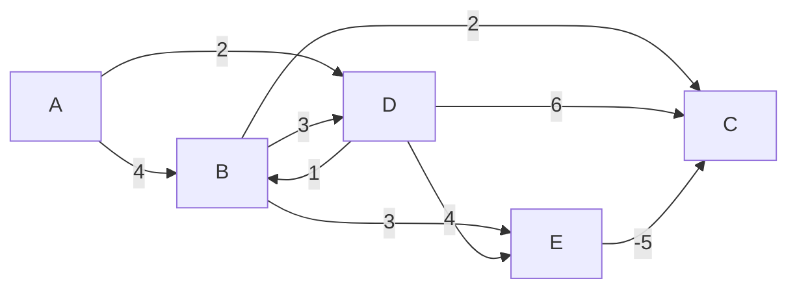
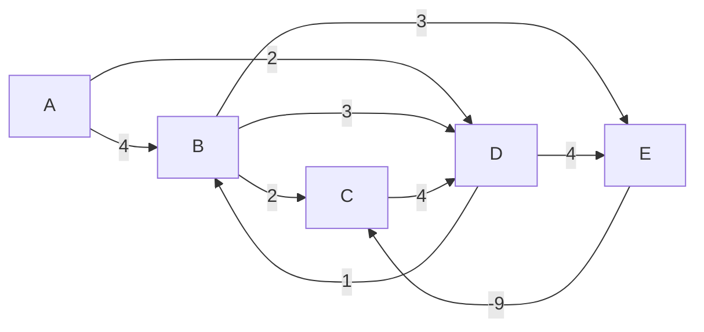

# Algorithms and Data Structures - Bellman-Ford

## Characteristics
- Time complexity:
  - Best: O(V) (when there are no negative edges and the shortest path is found in the first iteration)
  - Average: O(V)
  - Worst: O(V x E)
  - Worst: O(V x E) (when all edges need to be relaxed in every iteration)
- Space complexity: O(V) (storing distances and predecessors)

## Graphs

### No negative cycles

### With negative cycles

## Demos

- [Distances](./src/distances.py)
- [Distances with improved](./src/distances_improved.py)
- [Paths](./src/paths.py)

## References
- [Other Algorithms & Data Structures](https://github.com/NelsonBN/algorithms-data-structures)
